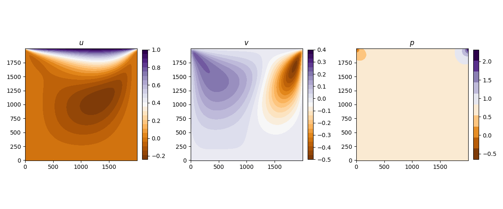
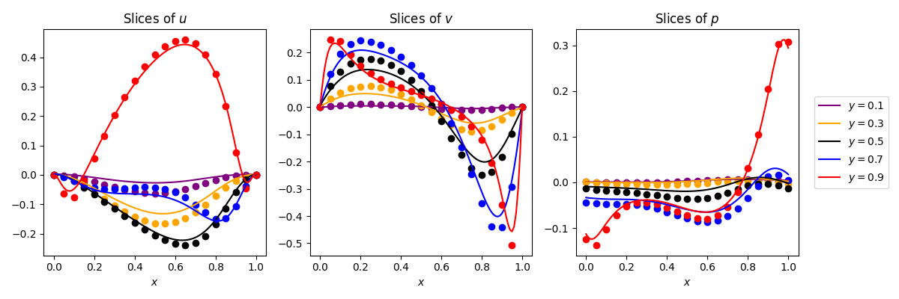
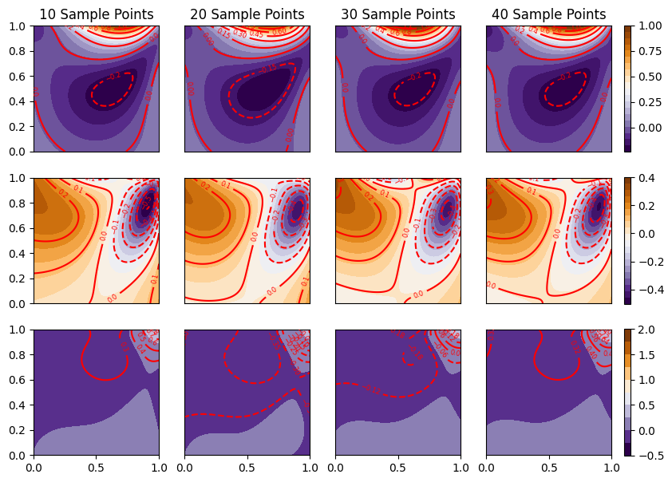

# Using a Physics-Informed Neural Network (PINN) to solve the forward and reconstruction problem of lid-driven cavity flow
The PINN was an MLP implemented in PyTorch.
Predicted fields

Horizontal slices taken through the domain show that the forward model (solid line) has excellent agreement with the "ground truth" spectral method solution (dots)

Reconstruction using a different number of points suggests that the PINN is a promising tool for reconstructing the entire field from a few observations.

